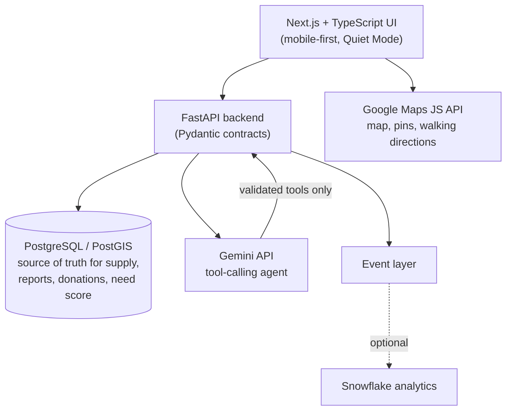

# PadForward 💗

> **No asking. No explaining. Just access.**
>
> *Someone left one for you.*

A community-powered **emergency menstrual-product access network**, built for the
DEV Community Weekend Challenge: **Generosity Edition**.

---

## The problem

Someone unexpectedly got their period while away from home. They went to a nearby
train station expecting a basic menstrual product would be available somewhere.
There wasn't one. They ended up using toilet paper — **despite having the money
and the means to buy pads.**

And there's a second barrier that's just as real: **asking is hard.** Periods are
normal — but asking a stranger in a crowded station *"do you have a pad?"* is
deeply personal.

> When someone unexpectedly gets their period in public, accessing a menstrual
> product can be surprisingly difficult — not because nobody has one, but because
> asking for one is deeply personal.

**PadForward removes the need to ask.**

## What it does

```
People who have spare products
            ↓
   Community donation points
            ↓
People who unexpectedly need products
```

- **NEED** — find community menstrual supplies at nearby stations. No account,
  no public request, no asking anyone. Walking directions in a few taps.
- **GIVE** — donate spare pads; the network (Gemini + a deterministic need-score
  engine) tells you exactly where they'll help most.
- **HELP** — adopt a station as a **Pad Champion**: verify supply, report
  shortages, coordinate donations.

The donor and recipient never meet. The platform is the anonymous bridge between
generosity and need.

## Architecture



**Key boundary:** Google Maps answers *"where is the station?"* — the PadForward
database answers *"does it have community supplies, how badly does it need them,
who supports it, and when was it last verified?"* Maps is never the inventory
system.

### Hackathon deployment vs designed architecture

For the hackathon the whole product ships as a **single Next.js app on Vercel**:
the FastAPI service was ported one-to-one to Next.js route handlers
(`apps/web/app/api/*` + `apps/web/server/*`) backed by an in-memory demo store,
keeping the exact same API contract. The **designed architecture** — FastAPI +
PostgreSQL/PostGIS behind that same contract — lives in `services/api` with
`docker-compose.yml` and a full pytest suite, and the frontend switches to it
with one env var (`NEXT_PUBLIC_API_URL`).

### Pages

`/` home · `/find` nearby stations · `/donate` donation flow · `/assistant`
AI agent · `/impact` network stats & generosity loop · `/champion` adopt a
station · `/about` the story behind PadForward · `/stations/[id]` station detail.

The UI uses the PadForward brand palette (logo pink `#d6246e` + purple
`#6d4fd4`) defined as Tailwind tokens in `apps/web/tailwind.config.js`.

## Tech stack

| Layer | Tech |
|---|---|
| Frontend | Next.js 14, TypeScript (strict), Tailwind CSS, Google Maps JS API |
| Backend | Python 3.11, FastAPI, Pydantic v2, SQLAlchemy 2 |
| Database | PostgreSQL + PostGIS (SQLite fallback for zero-setup dev) |
| AI | Gemini (`google-genai`) function-calling agent + deterministic fallback |
| Optional | Snowflake analytics, ElevenLabs voice (stretch, behind abstractions) |

## Google AI (Gemini) integration

This is **not a chatbot** — it's an agent. Gemini receives a registry of validated
application tools and decides which to call:

```
find_nearby_stations · get_station_status · get_station_facilities
get_walking_route · calculate_station_need · get_highest_need_locations
create_donation · report_supply_status · adopt_station
get_user_impact · find_locations_along_route
```

- *"I suddenly got my period and I'm at Central"* → `get_station_status` + `find_nearby_stations`
- *"I have 20 pads. Where should I donate?"* → `get_highest_need_locations`
- *"The donation box at Town Hall is empty"* → `report_supply_status(reported_supply=0)` — actually recorded
- *"I'm travelling from Redfern to Wynyard…"* → `find_locations_along_route`

**Safety:** the model can never write to the database directly — every action
goes through the same validated service layer as the REST API, and it may only
state availability that comes from tool results.

**The assistant never just fails — it degrades gracefully:**

1. **Gemini** (server) — full tool-calling agent on live network data.
2. **Deterministic engine** (server) — without a `GEMINI_API_KEY`, a keyword
   intent engine answers using the *same tools*.
3. **Browser built-in AI** (offline) — if the network is unreachable, the app
   tries the browser's on-device AI (Chrome Prompt API / Gemini Nano), grounded
   in the last cached station data and instructed never to invent availability.
4. **Offline heuristics** (last resort) — deterministic rules over cached map
   data: closest last-known supply if you need a pad, highest need score if you
   want to donate.

**Vision — "snap the box":** on a station page you can photograph the donation
box instead of counting pads yourself. Gemini vision estimates the count
(strict JSON, clamped, confidence-rated) and prefills a supply report; offline,
the same flow runs on the browser's built-in multimodal AI entirely on-device.
The photo is analyzed and discarded — never stored.

## Google Maps integration

- Interactive map with colour-coded, labelled supply pins (never colour-only)
- Browser geolocation with graceful manual fallback
- Walking directions via Google Maps deep links
- Accessible schematic SVG map fallback when no API key is present

## Need Score (deterministic, ML-ready)

Every station gets a 0–100 need score from an isolated module
(`services/api/app/scoring/need_score.py`):

```
40% supply shortage · 20% estimated demand · 15% time since verification
15% recent requests · 10% historical demand
```

`0–30 LOW · 31–60 MODERATE · 61–80 HIGH · 81–100 CRITICAL`

## Local setup

**Backend** (SQLite fallback — no Docker needed):

```bash
cd services/api
python -m venv .venv && source .venv/bin/activate
pip install -r requirements.txt
uvicorn app.main:app --reload          # http://localhost:8000 (auto-seeds demo data)
```

**Frontend:**

```bash
cd apps/web
npm install
npm run dev                            # http://localhost:3000
```

**With PostgreSQL:** `docker compose up db` then set `DATABASE_URL` from
`.env.example`.

**Tests:** `cd services/api && python -m pytest` (29 tests: need score, API
flows, AI agent intents & tool validation) and `cd apps/web && npm test`
(vitest: vision estimate parsing & vision API validation).

## Environment variables

See [.env.example](.env.example). Everything is optional — the app feature-detects
and degrades gracefully:

| Missing | Fallback |
|---|---|
| `GOOGLE_MAPS_API_KEY` | Accessible schematic map + station list |
| `GEMINI_API_KEY` | Deterministic recommendation/intent engine |
| Network entirely (offline) | Browser built-in AI (Chrome Prompt API) → heuristics on cached map data |
| `DATABASE_URL` | Local SQLite |
| Snowflake credentials | PostgreSQL analytics |

## Demo flow

1. **Need** — tap *I need a pad* → allow location (or browse demo stations) →
   see Central 🟢 Available, 12 pads, 4-min walk → directions → *"Someone left
   one for you. 💗"* — no account, ever.
2. **Donate** — tap *I want to donate* → 20 pads → *"Where should my donation
   go?"* → Museum Station 🔴 CRITICAL (need score 90+) → confirm → watch it flip
   to 🟢 Available and the need score collapse.
3. **Community** — open a station → report supply (🟢/🟡/🔴) → *Adopt this
   station* → champion count updates.
4. **AI** — ask *"I have 20 pads. Where should I donate them?"* → the agent calls
   `get_highest_need_locations` and answers from live data (tool calls shown in
   the UI).

> All stations are clearly-labelled **Demo Community Points** at real Sydney
> station coordinates. Supply figures are demo data, not real inventory.

## Privacy

- Finding a pad requires **no account** — nothing about the person is stored
- No menstrual data, no public requests, no identities on public activity
  (*"Someone donated 10 pads"* — never a name)
- Location is used transiently for discovery only; no location history
- Quiet Mode: minimal UI, no social feed, no questions

## Future roadmap

- **Phase 2** — transport operator partnerships, universities, libraries,
  workplaces, shelters
- **Phase 3** — demand forecasting, restock alerts, verified partner locations,
  QR-coded donation points, multilingual voice access
- **Phase 4** — a broader community **emergency-access network**

---

*Someone helps you today. When you're able, you help someone else.*
